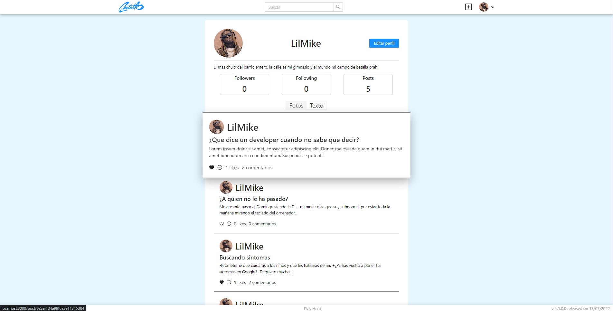

#  <center>CANTASTIK</center> 

 ## :clipboard: Indice 

 - [Sobre el proyecto](#sobre-el-proyecto)

    - [Tecnologías utilizadas](#wrench-tecnologías-utilizadas)

    - [Instalación y despliegue](#rocket-instalación-y-despliegue)

    - [Origen](#mag-origen)

    - [Concepto e inspiración](#blacknib-concepto-e-inspiración)

- [En el tintero](#pencil2-en-el-tintero)

- [Agradecimientos](#sparkles-agradecimientos)

- [Autor](#)

# Sobre el proyecto

## :wrench: Tecnologías utilizadas

```JSON
{
    "frontEnd":{
        "main":["JavaScript","React","Sass"],
        "modules":[
            "React-Redux",
            "Axios",
            "Sass",
            "React-Router-Dom",
            "Ant-Design",
            "Framer-motion",
            "React-infinite-scroll",
            "Dotenv",
        ]
    },
    backEnd:{
        main:["JavaScript","MongoDB","NodeJS","Express","Mongoose"],
        modules:[
            "Json-Web-Token",
            "BcryptJs",
            "Multer",
            "Nodemailer",
            "Dotenv",
            "Cors",
            "Validator",
        ]
    }
}
```

## :rocket: Instalación y despliegue

- BackEnd

    1. Descargar el repositorio de ["SocialNetwork_MongoDB"](https://github.com/MrSetOne/SocialNetwork_MongoDB) usando `git clone https://github.com/MrSetOne/SocialNetwork_MongoDB.git` desde la terminal en la carpeta que desees.

    2. Realiza la instalacion siguiendo los pasos indicados en el [README.md](https://github.com/MrSetOne/SocialNetwork_MongoDB/blob/main/README.md)

- FrontEnd

    1. Descargar el repositorio de ["cantastik-frontend"](https://github.com/MrSetOne/cantastik-frontend) usando `git clone https://github.com/MrSetOne/cantastik-frontend.git` desde la terminal en la carpeta que desees.

    2. Una vez clonado el repositorio hay que instalar todos los paquetes que necesita el proyecto con `npm i`

    3. En la raiz del proyecto encontraras el archivo ".env-example", este archivo carga la url del BackEnd, simplemente indica la direccion en la que se aloje dicho servivor

    4. Dentro de la carpeta clonada de ["SurvivorShop"](https://github.com/MrSetOne/SurvivorShop) tienes que ejecutar el comando `npm start`

## :mag: Origen


Este proyecto es planteado con la finalidad de generar un FrontEnd al BackEnd generado anteriormente basado en una red social, ambos trabajos individuales y así realizar nuestro primer proyecto FullStack en solitario.

## :black_nib: Concepto e inspiración


La idea desde el principio fue hacer una red social hibrida entre Instagram y Twitter, podrias subir fotos con o sin imagen como en Twitter pero con la estetica minimalista y "user friendly" de instagram.

En este proyecto he querido dar total prioridad a la experiencia del usuario, desde el momento de registrarse hasta su logout, pasando por la facilidad a la hora de dar a seguir a usuarios y perderse entre los perfiles, como pasa con Instagram.

Algunas capturas:




# :pencil2: En el tintero

Dado que el proyecto a sido con un tiempo muy limitado no he podido implementar todo lo que hubiese querido, para futuras versiones queda:

- [ ] Refactorizar el proyecto para hacerlo mas ligero

- [ ] Implementar vista de administrador

- [ ] Sistema de baneos

- [ ] Mejorar sistema de FeedBack al usuario

- [ ] CRUD de comentarios

- [ ] Mejorar la responsividad

- [ ] Motor de busqueda mejorado

- [ ] Opcion de compartir posts

- [ ] Implementar notificaciones

# :sparkles: Agradecimientos

En primer lugar agradecer a mis profesores [Sofía](https://github.com/SofiaPinilla), [Ger](https://github.com/GeerDev) e [Iván](https://github.com/ivanpuebla10), ya que cuando entré en el BootCamp solo conocia HTML, CSS y algo (casi nada) de JavaScript, desde luego sin sus clases y su paciencia este proyecto no hubiese sido posible.

En segundo lugar y no por ello menos importante agradecer tambien a mis compañeros de clase, que siempre puedo contar con ellos para lo que sea y siempre están dispuestos a echar una mano, dar alguna opinion, invitarme a copiar su codigo o simplemente pasar un buen rato de risas y olvidadando toda preocupación. [Xavi](https://github.com/xavi-mat), [Gabri](https://github.com/Gabo-Tech), [Rebeca](https://github.com/RebecaASuesta), [Ger](https://github.com/Molerog), [Shan](https://github.com/tianfanshan), [Yorch](https://github.com/Yorch82), [Vince](https://github.com/Vincecoorp21), [Vane](https://github.com/vaneebg), [Imanol](https://github.com/Imi21), [Alex](https://github.com/alextebbitt), [Fran](https://github.com/franpd8), [David](https://github.com/Dubesor22) y [Santi](https://github.com/Santiremix), sois los mejores y que nadie os haga dudar de ello, por vosotros repetia esta experiencia mil veces más. :green_heart:

# <center> :rocket: [Michael Lara Sánchez](https://github.com/MrSetOne) :rocket: </center>